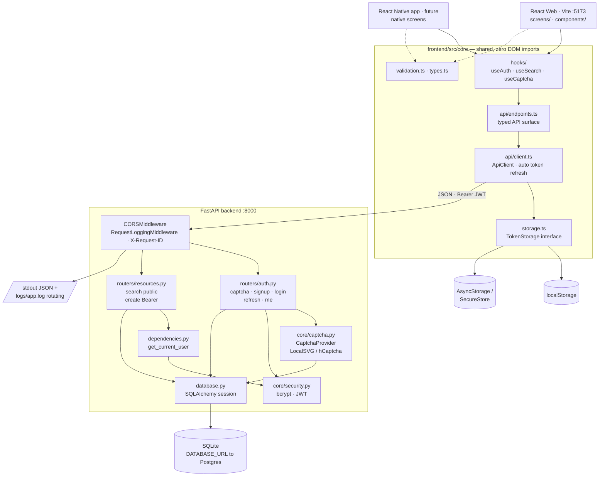
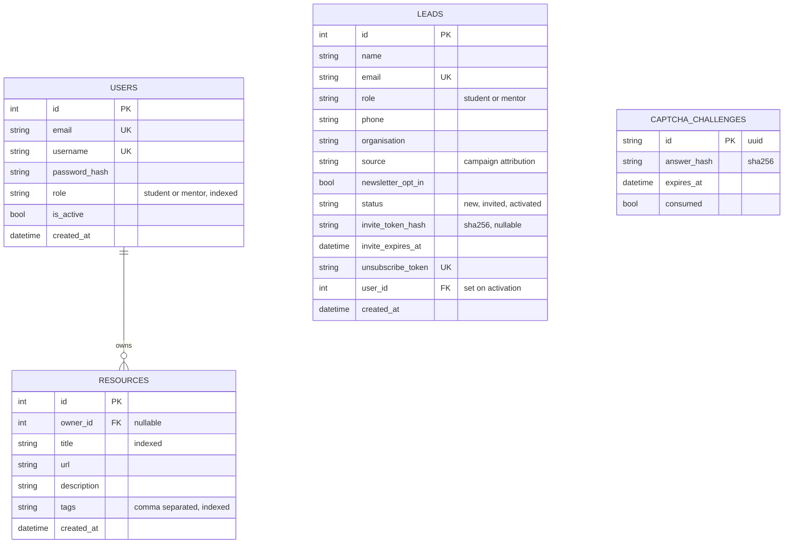
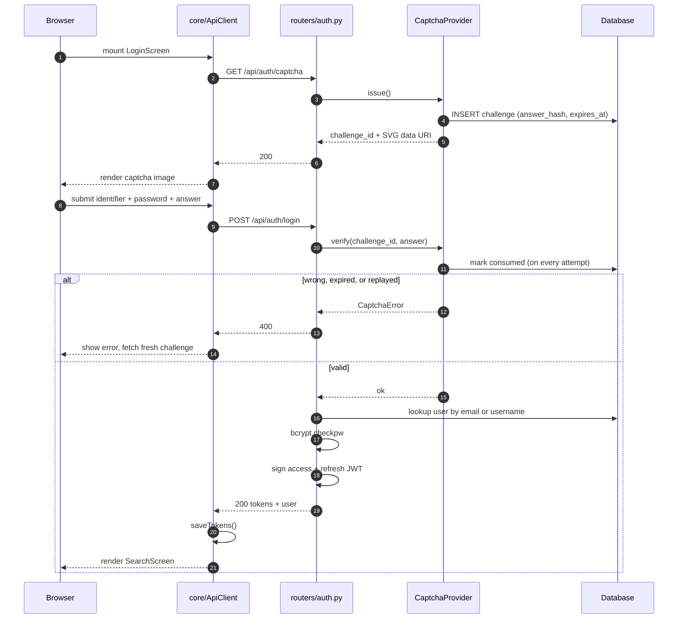
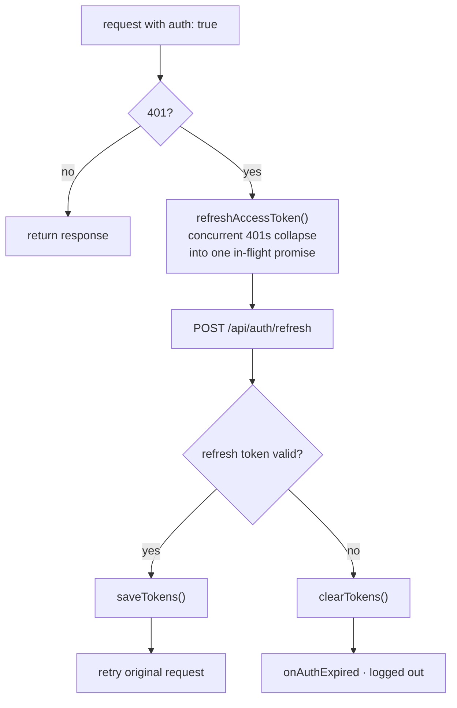

# Socioturtle MVP

A resource-bookmarking app: sign up with captcha, search a database of links.
The backend is a JSON API that serves the React web app today and a mobile app later.

```
backend/    FastAPI + SQLAlchemy (SQLite in dev, Postgres in prod)
frontend/   React + TypeScript + Vite — the app, plus the admin console
widget/     Vanilla-JS registration widget embedded in socioturtle.com
```

## The three pieces and how they fit

socioturtle.com is a **static GitHub Pages site**, so it cannot run Python. The
widget is plain JavaScript that lives in the site repo and calls the API
cross-origin; the API and the React app are deployed separately.

```
socioturtle.com (GitHub Pages, static)
   └── socioturtle-register.js  ──POST /api/leads──┐
                                                   ▼
                                    api.socioturtle.com (FastAPI, Render)
                                                   ▲
   app.socioturtle.com (React) ─────────────────────┘
     ├── invite links land here (?invite=…)
     └── admin console: leads, invites, newsletter
```

## Lead lifecycle

```
visitor registers on socioturtle.com
        │  captcha verified, row written to `leads`
        ▼
      NEW ──── admin clicks "Invite" ───▶ INVITED
                  one-time link emailed        │
                                               │ invitee clicks link,
                                               │ chooses their own password
                                               ▼
                                          ACTIVATED  (a real `users` row exists)
```

**No password is ever emailed.** The invite carries a single-use token (stored
hashed, 7-day expiry) and the recipient sets their own password on arrival. A
lead who never activates never has a live account.

## Backend

```bash
cd backend
python3 -m venv .venv
./.venv/bin/pip install -r requirements.txt
cp .env.example .env
./.venv/bin/python -c "import secrets; print(secrets.token_urlsafe(48))"   # paste into SECRET_KEY
./.venv/bin/python seed.py            # demo data + demo/demo-password-1
./.venv/bin/python -m uvicorn app.main:app --reload
```

Interactive API docs: http://127.0.0.1:8000/docs

```bash
./.venv/bin/python -m pytest      # 13 unit/integration tests
./.venv/bin/python smoke_test.py  # end-to-end against a running server
```

## Frontend

Requires Node.js 18+.

```bash
cd frontend
npm install
npm run dev        # http://localhost:5173, proxies /api to :8000
```

## API

| Method | Path | Auth | Purpose |
| --- | --- | --- | --- |
| GET | `/api/health` | – | Liveness probe |
| GET | `/api/auth/captcha` | – | Issue a captcha challenge |
| POST | `/api/auth/signup` | – | Register (captcha + `role` required) |
| POST | `/api/auth/login` | – | Sign in (captcha required) |
| POST | `/api/auth/refresh` | – | Exchange refresh for access token |
| GET | `/api/auth/me` | Bearer | Current user |
| GET | `/api/resources/search` | – | Search resources |
| POST | `/api/resources` | Bearer | Add a resource |
| POST | `/api/leads` | – | Register interest (captcha required) — used by the widget |
| GET | `/api/leads` | Admin | List / filter registrations |
| GET | `/api/leads/export.csv` | Admin | Download all registrations |
| POST | `/api/leads/invite` | Admin | Email one-time invite links |
| GET | `/api/invites/{token}` | – | Check an invite before showing the form |
| POST | `/api/invites/activate` | – | Redeem an invite, create the account |
| POST | `/api/newsletter/send` | Admin | Send an issue (or a test) |
| GET/POST | `/api/newsletter/unsubscribe` | – | One-click unsubscribe |

Search accepts `q` (matches title, description, tags, URL), `tag`, `limit`, `offset`.

## Running the whole flow locally

```bash
# 1. API — emails print to the log, no credentials needed
cd backend && ./.venv/bin/python -m uvicorn app.main:app --reload

# 2. App + admin console
cd frontend && npm run dev

# 3. The marketing-site widget
cd widget && python3 -m http.server 8080   # then open demo.html
```

Make yourself an admin so the Admin tab appears:

```bash
cd backend && ./.venv/bin/python manage.py make-admin mentor
```

With `EMAIL_BACKEND=console` every email is written to `logs/app.log` instead of
being sent. To pull an invite link out of the log:

```bash
grep '"message": "email_console"' logs/app.log | tail -1
```

## Operations CLI

```bash
python manage.py make-admin <username|email>
python manage.py list-admins
python manage.py leads [--role student] [--status new]
python manage.py send-newsletter "Subject" issue.md [--audience all]
```

## Sending real email

Set these in `backend/.env` (or the Render dashboard):

```
EMAIL_BACKEND=smtp
SMTP_HOST=smtp.zoho.in          # or smtp.gmail.com
SMTP_PORT=587
SMTP_USER=admin@socioturtle.com
SMTP_PASSWORD=<app password>
```

**Gmail needs an App Password**, not your account password, and requires 2FA to be
on. Gmail also caps sending at roughly 500/day — fine while the list is small,
but move to a dedicated sender (Resend, SES, Postmark) before the newsletter
outgrows that, or deliverability will suffer.

Always use **Send test** before **Send to subscribers**. There is no unsend.

## Architecture

### System overview



The `core` layer is the reuse boundary: everything above it is platform-specific,
everything inside it runs unchanged on web and native.

### Data model



`LEADS` is deliberately separate from `USERS`: a lead is interest, a user is an
account. `user_id` stays null until the invite is redeemed.

`tags` is denormalised into a comma-separated column so a single `LIKE` scan covers
title, description, tags, and URL without a join.

### Captcha-protected login



Marking the challenge consumed on *every* attempt is what stops a wrong answer from
being retried against the same image.

### Token refresh



This lives entirely in `core/api/client.ts` and uses only `fetch`, so a native app
inherits session handling for free.

## Design notes

**Auth.** Stateless JWT access + refresh tokens rather than cookie sessions, because
a mobile client cannot rely on browser cookie handling. Passwords are bcrypt-hashed.

**Roles.** Every account is either a `student` or a `mentor`, chosen once at signup and
stored on the user row. The login form deliberately has *no* role selector: if the client
could send a role at login, anyone could sign in to a student account claiming to be a
mentor. The role always comes back from the database in the `user` object, so the UI
renders a badge from server state rather than from anything the user typed.

**Captcha.** `CAPTCHA_PROVIDER=local` generates an SVG challenge server-side, so the
MVP runs with no third-party account. Challenges are single-use and TTL-bound —
verifying burns the challenge, so a wrong answer cannot be retried against the same
image. Switch to `CAPTCHA_PROVIDER=hcaptcha` with `HCAPTCHA_SECRET` for production;
the routers are unchanged because both implement the same `CaptchaProvider` interface.

**Logging.** Structured JSON to stdout plus a rotating file (`logs/app.log`). Every
request gets an `X-Request-ID` (honoured from the inbound header if present) that is
attached to every log line emitted during that request, so a single request can be
traced across auth, search, and error logs.

**Database.** SQLite via SQLAlchemy ORM. Point `DATABASE_URL` at Postgres to switch —
no code changes. There are no migrations yet; tables are created at startup.

## Sharing code with a mobile app

`frontend/src/core/` contains no DOM or web-specific imports and is meant to be
lifted into a React Native app as-is:

- `api/client.ts` — `fetch`-based client with automatic token refresh
- `api/endpoints.ts` — typed API surface
- `hooks/` — `useAuth`, `useSearch`, `useCaptcha` hold all the screen logic
- `types.ts`, `validation.ts` — shared contracts and form rules

Platform differences are isolated behind the `TokenStorage` interface in
`core/storage.ts`: web uses `localStorage`, native supplies AsyncStorage or
SecureStore. `components/` and `screens/` are the only web-only layers — a native
app rewrites those and reuses everything else.

**Invites, not passwords.** Emailed passwords sit in inboxes indefinitely, get
forwarded, and surface in breaches. The invite instead carries a single-use token
— stored as a SHA-256 hash, expiring in 7 days, cleared the moment it is redeemed
or a send fails. If the mail fails to go out the token is rolled back, so a failed
send never leaves a live link behind.

**Consent and unsubscribe.** The newsletter checkbox is opt-in and unticked by
default, and the flag is only ever set to true by an explicit tick. Every issue
carries an unsubscribe link plus the RFC 8058 `List-Unsubscribe` headers that let
Gmail and Outlook show their own one-click button — which materially helps you
stay out of spam folders. Unsubscribing with an unknown token renders the same
page as a valid one, so the endpoint cannot be used to test whether an address is
on the list.

## Known limitations (MVP)

- Search uses `LIKE` scans. Move to SQLite FTS5 or Postgres full-text at scale.
- No rate limiting on login; failures are logged but not throttled.
- No email verification or password reset.
- Refresh tokens are not revocable — logout clears the client only.
- No schema migrations (add Alembic before the first production deploy).
- Web navigation is local state, not URL routing; add React Router if deep links matter.
- **The public lead endpoint is captcha-protected but not rate-limited.** Worth
  adding a per-IP limit before the widget goes live on a public page.
- **Newsletter sends run inside the HTTP request.** Fine for a few hundred
  subscribers; beyond that the request will time out and it needs a task queue.
- No bounce or complaint handling — repeatedly mailing dead addresses will hurt
  your sender reputation.
- Emails are not DKIM/SPF-signed by this code; configure that on the sending
  domain or invites will land in spam.
